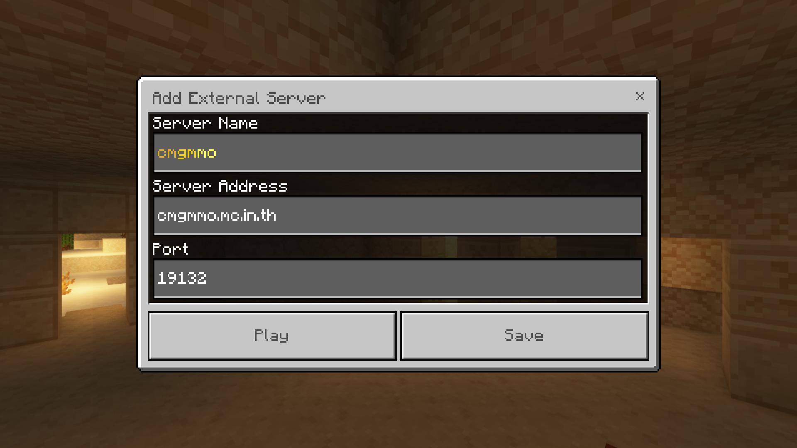

# 📜 เกี่ยวกับพวกเรา

CMGMMO เป็นเซิร์ฟเวอร์ Minecraft แนว MMO ที่เปิดให้บริการในประเทศไทยมาอย่างยาวนาน โดยให้บริการแบบ Bedrock Edition นอกจากนี้ เรายังมีทีมงานที่คอยดูแลเซิร์ฟเวอร์อย่างใกล้ชิด เพื่อให้ผู้เล่นทุกคนได้สัมผัสประสบการณ์การเล่นเกมที่สนุกสนาน!

..แต่ว่าคุณรู้ใช่ไหมว่าผู้เล่นใหม่มักมองว่าเซิร์ฟเวอร์ของเราเล่นยาก? เราเข้าใจและอยากให้ทุกคนสนุกไปกับ CMGMMO ได้ง่าย ๆ เลยจัดทำสิ่งนี้ขึ้นมาเพื่อเป็นคู่มือสุดสะดวกสะบาย!

หากสนใจเข้าร่วม CMGMMO สามารถเข้าร่วมได้ง่ายๆ เพียงทำตามขั้นตอนต่อไปนี้สำหรับ มือถือและคอมพิวเตอร์ สามารถกดที่นี่ได้เลย: [cmgmmo](https://cmgmmo.vercel.app)!                              แต่ถ้าหากคุณใช้ IOS/IPHONE กรุณาเพิ่มเซิร์ฟเวอร์ด้วยตัวคุณเอง

```
ชื่อเซิร์ฟเวอร์  | cmgmmo
ที่อยู่เซิร์ฟเวอร์ | cmgmmo.mc.in.th
พอร์ตซิร์ฟเวอร์ | 21356
```

<div align="left" data-full-width="false">

<figure><figcaption><p>ตัวอย่างการเพิ่มเซิร์ฟเวอร์ CMGMMO! ในหน้าต่าง Add Server</p></figcaption></figure>

</div>

## ติดต่อทีมงาน

ถ้ามีข้อสงสัย ติดขัด อะไรก็ตาม! ไม่ต้องกังวล ทีมงานของเรายินดีช่วยเหลือเสมอ ติดต่อกับเราได้ง่ายๆ เพียงคลิกที่นี่เพื่อเข้า [Discord Server](https://discord.com/invite/Rg4dCxW5ZH) ของเรา
